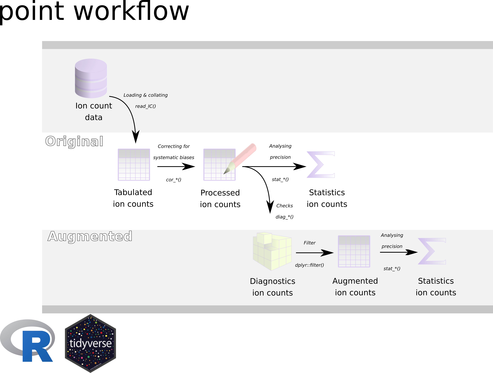

<!--  use the --webtex argument in the YAML to render equations -->

```{r, include = FALSE}
knitr::opts_chunk$set(
  collapse = TRUE,
  comment = "#>",
  fig.path = "man/figures/README-",
  out.width = "100%",
  warning = FALSE, 
  results = "asis",
  encoding ='UTF-8'
)
```


<!-- badges: start -->
[](http://www.gnu.org/licenses/gpl-3.0)
[](https://zenodo.org/badge/latestdoi/240023228)
[](https://travis-ci.org/MartinSchobben/point)
<!-- badges: end -->


# Introduction to point
This project was originally inspired by the lack of detailed insight in the inner workings of the default software for the *Cameca NanoSIMS50L* (Utrecht University). Hence this project has the objective of processing raw ion count data into ion and isotope ratios of point-sourced measurements. Combined with statistics for the internal and external precision of, respectively, individual analyses and complete series of analyses, this functionality allows for the interrogation of the analytical consistency. Access to raw ion count data is, furthermore, useful as it allows detection of anomalous values associated with e.g. machine instability or heterogeneity of the analysed sample. Upon detection, anomalous values can be omitted or further analysed to delineate the source of variation.

The point package is still under development but the master branch is functioning. Functionality is automatically tested with Travis CI.


```{r pkgs, echo=FALSE, message=FALSE}
# following code for loading and writing the bibtex references for the used pkgs
pkgs <- c("dplyr", "tidyr", "tibble", "stringr", "readr", "magrittr",
          "ggplot2", "polyaAeppli", "nlme", "rlang", "purrr", "devtools", 
          "roxygen2", "testthat", "knitr", "rmarkdown", "bookdown", "broom", 
          "mgcv", "broom", "broom.mixed")    
# Get the R reference
rref <- citation()
# Create ref key
rref$key <- "rversion"
hadley <- bibentry(
  key = "Wickham2015",
  bibtype = "Book",
  title = "R packages: organize, test, document, and share your code",
  author =  person("Hadley","Wickham"),
  year = "2015",
  publisher = " O'Reilly Media, Inc.",
  url = "https://r-pkgs.org/"
  )
knitr::write_bib(pkgs, "packages.bib", prefix = "")
pkgs <- bibtex::read.bib("packages.bib")
bibtex::write.bib(
  purrr::reduce(list(rref, hadley, pkgs), append), 
  file = "packages.bib"
  )
invisible(file.copy("packages.bib", "vignettes/packages.bib", overwrite = TRUE))
```


## Credits

The construction of the R [@rversion] package *point* and associated documentation was aided by the packages; *devtools* [@devtools], *roxygen2* [@roxygen2], *testthat* [@testthat], *knitr* [@knitr2014 ; @knitr2015], *rmarkdown* [@rmarkdown2018; @rmarkdown2020], *bookdown* [@bookdown2016] and the superb guidance in the book: *R packages: organize, test, document, and share your code*, by @Wickham2015. In addition, this package relies on a set of external packages from the tidyverse universe, including: *dplyr* [@dplyr], *tidyr* [@tidyr], *tibble* [@tibble], *stringr* [@stringr], *readr* [@readr], *magrittr* [@magrittr], *rlang* [@rlang], and *purrr* [@purrr] for internal functioning as well as specialised statistics; *polyaAeppli* [@polyaAeppli], *broom* [@broom], *broom.mixed* [@broom.mixed], *nlme* [@nlme], and *mgcv* [@mgcv]. Plots are made with *ggplot2* [@ggplot22016]


## Installation

You can install the released version of point 

``` r
# Install point from GitHub:
# install.packages("devtools")
devtools::install_github("MartinSchobben/point")
```

## Usage

Load point with `library`.

```r
library(point)
```

## The point workflow
 
A more detailed outline of the general point workflow is given in the vignette *IC-introduction* (`vignette("IC-introduction")`). 

```{r workflow-graph, out.width="100%", echo=FALSE}

```


To read, process and analyse raw ion count data use the functions:

* `read_IC()`: raw ion count data (Cameca NanoSIMS 50L)
* `cor_IC()`: process ion count data
* `stat_X()`: analyse single ion count data
* `stat_R()`: analyse ion ratios
* `diag_R()`: diagnose ion ratios

## Example 1: internal precision of isotope ratios

This is an example of how *Cameca NanoSIMS50L* raw data files can be extracted, processed and analysed for the ^13^C/^12^C isotope ratio ($R$). This produces a [tibble](https://tibble.tidyverse.org/) with descriptive and predictive (Poisson) statistics (demarcated with an \^) of the ion count data. This can be done for single analysis in order to obtain internal precision.


```{r setup-point, message=FALSE, echo=FALSE}
library(point)
```


```{r example1}
# Use point_example() to access the examples bundled with this package in the
# inst/extdata directory.

# Raw data containing 13C and 12C counts on carbonate
tb_rw <- read_IC(point_example("2018-01-19-GLENDON"))

# Processing raw ion count data
tb_pr <- cor_IC(tb_rw)

# Internal precision for 13C/12C ratios
tb_R <- stat_R(tb_pr, "13C", "12C", sample.nm, file.nm, .label = "webtex")
```


```{r echo=FALSE}
knitr::kable(tb_R, format.args = list(digits = 3, format = "G", flag = "0")) 
```


## Example 2: external precision of isotope ratios

To calculate the external reproducibility of isotope ratios one needs to use the `.nest` argument to define sets of analyses.

  
```{r example2}
# external precision for 13C/12C ratios
tb_R <- stat_R(tb_pr, "13C", "12C", sample.nm, file.nm, .nest = sample.nm, 
               .label = "webtex")
```


```{r echo=FALSE}
knitr::kable(tb_R, format.args = list(digits = 3, format = "G", flag = "0")) 
```


For more detailed information:

*IC-read* (`vignette("IC-read")`): reading raw ion count data use     
*IC-process* (`vignette("IC-process")`): processing ion count data        
*IC-precision* (`vignette("IC-precision")`): statistics concerning ion count precision    
*IC-diagnostics* (`vignette("IC-diagnostics")`): diagnostics on internal variation


# References
