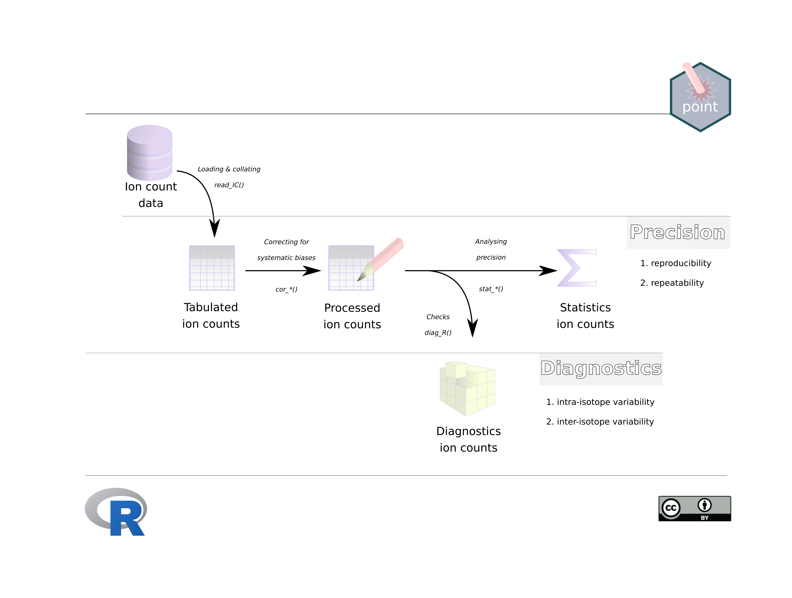

# point 

<!-- badges: start -->

[](http://www.gnu.org/licenses/gpl-3.0)
[](https://zenodo.org/badge/latestdoi/240023228)
[](https://github.com/MartinSchobben/point/actions)
[](https://app.codecov.io/gh/MartinSchobben/point?branch=master)
<!-- badges: end -->

# Introduction to point

This project was originally inspired by the lack of detailed insight in
the inner workings of the default software for the *Cameca NanoSIMS50L*
(Utrecht University). Hence this project has the objective of processing
raw ion count data into ion and isotope ratios of point-sourced
measurements. Combined with statistics for the internal and external
precision of, respectively, individual analyses and complete series of
analyses, this functionality allows for the interrogation of the
analytical consistency. Access to raw ion count data is, furthermore,
useful as it allows detection of anomalous values associated with
e.g. machine instability or heterogeneity of the analysed substrate.
Upon detection, anomalous values can be omitted or further analysed to
delineate the source of variation.

The point package is still under development but the master branch is
functioning. Functionality is automatically tested with CI.

## Credits

The construction of the R (R Core Team 2022) package *point* and
associated documentation was aided by the packages; *devtools* (Wickham,
Hester, et al. 2021), *roxygen2* (Wickham, Danenberg, et al. 2021),
*testthat* (Wickham 2022), *knitr* (Xie 2014 ; Xie 2015), *rmarkdown*
(Xie, Allaire, and Grolemund 2018; Xie, Dervieux, and Riederer 2020),
*bookdown* (Xie 2016) and the superb guidance in the book: *R packages:
organize, test, document, and share your code*, by Wickham (2015). In
addition, this package relies on a set of external packages from the
tidyverse universe, including: *dplyr* (Wickham et al. 2022), *tidyr*
(Wickham and Girlich 2022), *tibble* (Müller and Wickham 2021),
*stringr* (Wickham 2019), *readr* (Wickham, Hester, and Bryan 2022),
*magrittr* (Bache and Wickham 2022), *rlang* (Henry and Wickham 2022),
and *purrr* (Henry and Wickham 2020) for internal functioning as well as
specialised statistics; *polyaAeppli* (Burden 2014), *broom* (Robinson,
Hayes, and Couch 2022), *broom.mixed* (Bolker and Robinson 2022), *nlme*
(Pinheiro, Bates, and R Core Team 2022), and *mgcv* (Wood 2022). Plots
are made with *ggplot2* (Wickham 2016)

## Installation

You can install the released version of point

``` r
# Install point from GitHub:
# install.packages("devtools")
devtools::install_github("MartinSchobben/point")
```

## Usage

Load point with `library`.

``` r
library(point)
```

## The point workflow

A more detailed outline of the general point workflow is given in the
vignette *IC-introduction* (`vignette("IC-introduction")`).



To read, process and analyse raw ion count data use the functions:

-   `read_IC()`: raw ion count data (Cameca NanoSIMS 50L)
-   `cor_IC()`: process ion count data
-   `stat_X()`: analyse single ion count data
-   `stat_R()`: analyse ion ratios
-   `diag_R()`: diagnose ion ratios

## Example 1: internal precision of isotope ratios

This is an example of how *Cameca NanoSIMS50L* raw data files can be
extracted, processed and analysed for the <sup>13</sup>C/<sup>12</sup>C
isotope ratio (). This
produces a [tibble](https://tibble.tidyverse.org/) with descriptive and
predictive (Poisson) statistics (demarcated with an ^) of the ion count
data. This can be done for single analysis in order to obtain internal
precision.

``` r
# Use point_example() to access the examples bundled with this package in the
# inst/extdata directory.

# Raw data containing 13C and 12C counts on carbonate
tb_rw <- read_IC(point_example("2018-01-19-GLENDON"), meta = TRUE)
#> Registered S3 methods overwritten by 'readr':
#>   method                    from 
#>   as.data.frame.spec_tbl_df vroom
#>   as_tibble.spec_tbl_df     vroom
#>   format.col_spec           vroom
#>   print.col_spec            vroom
#>   print.collector           vroom
#>   print.date_names          vroom
#>   print.locale              vroom
#>   str.col_spec              vroom

# Processing raw ion count data
tb_pr <- cor_IC(tb_rw)

# Internal precision for 13C/12C ratios
tb_R <- stat_R(tb_pr, "13C", "12C", sample.nm, file.nm, .label = "webtex")
```

| sample.nm        | file.nm                 | ratio.nm |  |  |  |  (‰) |  |  (‰) |  |  (‰) |  |  (‰) |  |
|:-----------------|:------------------------|:---------|-------------------------------------------------:|--------------------------------------------------------------------------:|------------------------------------------------------------------:|----------------------------------------------------------------------------------------------:|-------------------------------------------------------------------------------------------:|-----------------------------------------------------------------------------------------------------------------------:|-------------------------------------------------------------------------------------------:|-----------------------------------------------------------------------------------------------------------------------:|--------------------------------------------------------------------------------------------------------------------:|------------------------------------------------------------------------------------------------------------------------------------------------:|------------------------------------------------------------------------------------------------:|
| Belemnite,Indium | 2018-01-19-GLENDON_1\_1 | 13C/12C  |                                             3900 |                                                                     0.011 |                                                          0.001021 |                                                                                          93.0 |                                                                                   1.63e-05 |                                                                                                                   1.49 |                                                                                   0.001019 |                                                                                                                   92.8 |                                                                                                            1.63e-05 |                                                                                                                                            1.49 |                                                                                            1.00 |
| Belemnite,Indium | 2018-01-19-GLENDON_1\_2 | 13C/12C  |                                             3900 |                                                                     0.011 |                                                          0.000779 |                                                                                          70.8 |                                                                                   1.25e-05 |                                                                                                                   1.13 |                                                                                   0.000771 |                                                                                                                   70.1 |                                                                                                            1.23e-05 |                                                                                                                                            1.12 |                                                                                            1.02 |
| Belemnite,Indium | 2018-01-19-GLENDON_1\_3 | 13C/12C  |                                             3900 |                                                                     0.011 |                                                          0.000733 |                                                                                          66.5 |                                                                                   1.17e-05 |                                                                                                                   1.06 |                                                                                   0.000722 |                                                                                                                   65.5 |                                                                                                            1.16e-05 |                                                                                                                                            1.05 |                                                                                            1.03 |

## Example 2: external precision of isotope ratios

To calculate the external reproducibility of isotope ratios one needs to
use the `.nest` argument to define sets of analyses.

``` r
# external precision for 13C/12C ratios
tb_R <- stat_R(tb_pr, "13C", "12C", sample.nm, file.nm, .nest = file.nm, 
               .label = "webtex")
```

| sample.nm        | ratio.nm |  |  |  |  (‰) |  |  (‰) |  |  (‰) |  |  (‰) |  |
|:-----------------|:---------|-------------------------------------------------:|---------------------------------------------------------------------------------------------------:|-------------------------------------------------------------------------------------------:|-----------------------------------------------------------------------------------------------------------------------:|--------------------------------------------------------------------------------------------------------------------:|------------------------------------------------------------------------------------------------------------------------------------------------:|--------------------------------------------------------------------------------------------------------------------:|------------------------------------------------------------------------------------------------------------------------------------------------:|---------------------------------------------------------------------------------------------------------------------------------------------:|-------------------------------------------------------------------------------------------------------------------------------------------------------------------------:|-------------------------------------------------------------------------------------------------------------------------:|
| Belemnite,Indium | 13C/12C  |                                                3 |                                                                                              0.011 |                                                                                   2.03e-05 |                                                                                                                   1.85 |                                                                                                            1.17e-05 |                                                                                                                                            1.07 |                                                                                                             1.3e-05 |                                                                                                                                            1.18 |                                                                                                                                      7.5e-06 |                                                                                                                                                                    0.681 |                                                                                                                     2.45 |

For more detailed information:

*IC-read* (`vignette("IC-read")`): reading raw ion count data use  
*IC-process* (`vignette("IC-process")`): processing ion count data  
*IC-precision* (`vignette("IC-precision")`): statistics concerning ion
count precision  
*IC-diagnostics* (`vignette("IC-diagnostics")`): diagnostics on internal
variation

# References

<div id="refs" class="references csl-bib-body hanging-indent">

<div id="ref-magrittr" class="csl-entry">

Bache, Stefan Milton, and Hadley Wickham. 2022. *Magrittr: A
Forward-Pipe Operator for r*.
<https://CRAN.R-project.org/package=magrittr>.

</div>

<div id="ref-broom.mixed" class="csl-entry">

Bolker, Ben, and David Robinson. 2022. *Broom.mixed: Tidying Methods for
Mixed Models*. <https://github.com/bbolker/broom.mixed>.

</div>

<div id="ref-polyaAeppli" class="csl-entry">

Burden, Conrad. 2014. *polyaAeppli: Implementation of the Polya-Aeppli
Distribution*. <https://CRAN.R-project.org/package=polyaAeppli>.

</div>

<div id="ref-purrr" class="csl-entry">

Henry, Lionel, and Hadley Wickham. 2020. *Purrr: Functional Programming
Tools*. <https://CRAN.R-project.org/package=purrr>.

</div>

<div id="ref-rlang" class="csl-entry">

———. 2022. *Rlang: Functions for Base Types and Core r and Tidyverse
Features*. <https://CRAN.R-project.org/package=rlang>.

</div>

<div id="ref-tibble" class="csl-entry">

Müller, Kirill, and Hadley Wickham. 2021. *Tibble: Simple Data Frames*.
<https://CRAN.R-project.org/package=tibble>.

</div>

<div id="ref-nlme" class="csl-entry">

Pinheiro, José, Douglas Bates, and R Core Team. 2022. *Nlme: Linear and
Nonlinear Mixed Effects Models*.
<https://svn.r-project.org/R-packages/trunk/nlme/>.

</div>

<div id="ref-rversion" class="csl-entry">

R Core Team. 2022. *R: A Language and Environment for Statistical
Computing*. Vienna, Austria: R Foundation for Statistical Computing.
<https://www.R-project.org/>.

</div>

<div id="ref-broom" class="csl-entry">

Robinson, David, Alex Hayes, and Simon Couch. 2022. *Broom: Convert
Statistical Objects into Tidy Tibbles*.
<https://CRAN.R-project.org/package=broom>.

</div>

<div id="ref-Wickham2015" class="csl-entry">

Wickham, Hadley. 2015. *R Packages: Organize, Test, Document, and Share
Your Code*. O’Reilly Media, Inc. <https://r-pkgs.org/>.

</div>

<div id="ref-ggplot22016" class="csl-entry">

———. 2016. *Ggplot2: Elegant Graphics for Data Analysis*.
Springer-Verlag New York. <https://ggplot2.tidyverse.org>.

</div>

<div id="ref-stringr" class="csl-entry">

———. 2019. *Stringr: Simple, Consistent Wrappers for Common String
Operations*. <https://CRAN.R-project.org/package=stringr>.

</div>

<div id="ref-testthat" class="csl-entry">

———. 2022. *Testthat: Unit Testing for r*.
<https://CRAN.R-project.org/package=testthat>.

</div>

<div id="ref-roxygen2" class="csl-entry">

Wickham, Hadley, Peter Danenberg, Gábor Csárdi, and Manuel Eugster.
2021. *Roxygen2: In-Line Documentation for r*.
<https://CRAN.R-project.org/package=roxygen2>.

</div>

<div id="ref-dplyr" class="csl-entry">

Wickham, Hadley, Romain François, Lionel Henry, and Kirill Müller. 2022.
*Dplyr: A Grammar of Data Manipulation*.
<https://CRAN.R-project.org/package=dplyr>.

</div>

<div id="ref-tidyr" class="csl-entry">

Wickham, Hadley, and Maximilian Girlich. 2022. *Tidyr: Tidy Messy Data*.
<https://CRAN.R-project.org/package=tidyr>.

</div>

<div id="ref-readr" class="csl-entry">

Wickham, Hadley, Jim Hester, and Jennifer Bryan. 2022. *Readr: Read
Rectangular Text Data*. <https://CRAN.R-project.org/package=readr>.

</div>

<div id="ref-devtools" class="csl-entry">

Wickham, Hadley, Jim Hester, Winston Chang, and Jennifer Bryan. 2021.
*Devtools: Tools to Make Developing r Packages Easier*.
<https://CRAN.R-project.org/package=devtools>.

</div>

<div id="ref-mgcv" class="csl-entry">

Wood, Simon. 2022. *Mgcv: Mixed GAM Computation Vehicle with Automatic
Smoothness Estimation*. <https://CRAN.R-project.org/package=mgcv>.

</div>

<div id="ref-knitr2014" class="csl-entry">

Xie, Yihui. 2014. “Knitr: A Comprehensive Tool for Reproducible Research
in R.” In *Implementing Reproducible Computational Research*, edited by
Victoria Stodden, Friedrich Leisch, and Roger D. Peng. Chapman;
Hall/CRC. <http://www.crcpress.com/product/isbn/9781466561595>.

</div>

<div id="ref-knitr2015" class="csl-entry">

———. 2015. *Dynamic Documents with R and Knitr*. 2nd ed. Boca Raton,
Florida: Chapman; Hall/CRC. <https://yihui.org/knitr/>.

</div>

<div id="ref-bookdown2016" class="csl-entry">

———. 2016. *Bookdown: Authoring Books and Technical Documents with R
Markdown*. Boca Raton, Florida: Chapman; Hall/CRC.
<https://bookdown.org/yihui/bookdown>.

</div>

<div id="ref-rmarkdown2018" class="csl-entry">

Xie, Yihui, J. J. Allaire, and Garrett Grolemund. 2018. *R Markdown: The
Definitive Guide*. Boca Raton, Florida: Chapman; Hall/CRC.
<https://bookdown.org/yihui/rmarkdown>.

</div>

<div id="ref-rmarkdown2020" class="csl-entry">

Xie, Yihui, Christophe Dervieux, and Emily Riederer. 2020. *R Markdown
Cookbook*. Boca Raton, Florida: Chapman; Hall/CRC.
<https://bookdown.org/yihui/rmarkdown-cookbook>.

</div>

</div>
