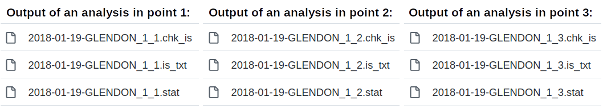

```{r, include = FALSE}
knitr::opts_chunk$set(
  collapse = TRUE,
  comment = "#>"
)
```
  

```{r loc, echo=FALSE, message=FALSE}
here::i_am("vignettes/IC-introduction.Rmd")
```

<!--
LP: See below my suggested changes to this text. Note that there are still some open questions about certain formulations.
-->

<!--
Original text by MS:

# Introduction to point

The large imprecision in secondary ion generation during Secondary Ion Mass Spectrometry (SIMS) analyses, and associated registration of ion counts with the detection devices, requires the generation of large quantities of data in order to suppress the uncertainty associated with the final output value. This would be the case either with single ion abundances or isotope ratios, and causes the accumulation of large datasets and numerous files. Additional meta-data files record machine-specific settings, e.g., regarding the optics, beam stability and mass spectrometer of, e.g., a *Cameca NanoSIMS 50L* [@Slodzian1992] for my studies, that vary depending on the type of analyses or environmental conditions. And, although, the default software of the instrument (e.g. Cameca^TM^ software [@Cameca]) can do all of this data accumulation and transformation, there are certain benefits in getting more control on those actions, which are hidden away in the code of the commercial software. Foremost, it enables controlling ion count corrections related to systematic biases which are linked to the detection systems. Furthermore, more control on the data analysis allows sub-setting or collating of analyses to calculate either internal or external precision of the study. Perhaps the most powerful aspect of the greater freedom associated with the usage of point is the performance of diagnostics that evaluate the internal consistency of the ion count ratios. These diagnostics can inform about factors that are normally not easily detectable, such as, heterogeneity of the sampled surface or instability of the instrument during individual runs. All of these features are in discussed in detail in the accompanying vignettes, whereas this vignette will only delve into the basics of the work-flow.

# Nomenclature
Concise terminology is required when discussing pulsed ion count data to prevent ambiguity surrounding for instance the usage of terms such as the analytical substrate (the rock or biological sample), machine set-up and instrument performance as well as conventions associated with statistics. It would become easy to mix-up terms, as, for instance, sample can refer to the physical sample analysed during a study, but sample can also relate to the set of individual objects collected during a statistical analysis, as such we refer henceforward to analytical substrate when discussing the former. The levels at which ion counts are detected and accumulated during a study can be another source of confusion, where we have the single instance of an ion hitting the detector, or the event. However, in order to get an idea of the abundance of a certain chemical species, we need of course a suite of these events which then together constitute a single measurement. So, the measurement ($N_i$) would the minimal level at which the machine starts recording and generating data output. Due to the fundamental imprecision of pulsed ion count measurements, it is necessary to record a whole collection, or series, of these measurements in order to limit the uncertainty surrounding our abundance estimate of the chemical species. In other words, we want to know how well our sample (i.e., the statistical sample) approximates the true population mean ($\mu$). This accumulation of measurements, or $n$-series of measurements, is then collectively referred to as an analysis (or $N_{(i)} = M_j$). A study, on for instance the carbon isotope composition of a carbonate rock, would not only rely on one such analysis, but would compare a suite of analyses across its surface, or even between different specimens. This is then referred to as a study, or $m$-series of analyses $M_{(j)}$.

To summarise:

* Sample: sample of the true population
* Analytical substrate: physical sample measured during SIMS analysis
* Event: single event of an ion hitting the detector
* Measurement: single count cycle $N_i$
* Analysis: $n$-series of measurements $N_{(i)} = M_j$ 
* Study: $m$-series of analyses $M_{(j)}$, constituting the different spots on the analytical substrate  

This terminology has been used throughout the documentation of the package point, and the above summary has been included in each of the vignettes for convenience. 

```{r setup}
library(point) # load package
```

-->

# Introduction

The precision of isotope ratio measurements by Secondary Ion Mass Spectrometry (SIMS) is limited by the randomness associated with the two principal stages of the measurement:

- generation of secondary ions during the interrogation of the analytical substrate by the primary ion beam, and
- detection of the secondary ions with the detection device. 

To partially circumvent this limitation, secondary ions emitted from a specific point on the analytical substrate are accumulated over extended time intervals (over so-called "measurement cycles") while recording secondary ion count data as well as auxiliary metadata about the status of the instrument (e.g., secondary ion optics, mass spectrometer, primary ion beam intensity). This output is exported in three types of data files (extensions `chk_is`, `stat`, and `is_txt`) and saved in a folder specified by the user, as shown in the figure below.

```{r, echo=FALSE, fig.align="center", out.width="80%", fig.cap="An example of an output generated by the Cameca NanoSIMS 50L instrument during the measurement of the ^13^C/^12^C isotope ratio in three spots on the substrate. Three data files are generated for each analysed spot. The data is available in the folder [inst/extdata/2018-01-19-GLENDON/](inst/extdata/2018-01-19-GLENDON/)."}

```

Although the proprietary software supplied by Cameca makes it easy and relatively straight-forward to process and analyse the ion count data and metadata generated during the measurement, the exact details behind these actions are hidden away. The aim of the R-package *point* is to provide more transparency and, ultimately, more control over the steps involved in the analysis of this type of data. Foremost, the *point* package enables controlling ion count corrections related to systematic biases which are linked to the detection systems. Furthermore, it allows sub-setting or collating of analyses to calculate internal or external precision of the measurements. Finally, and perhaps most importantly, it provides diagnostic tools for evaluating the internal consistency of the ion count ratios, which can be used to identify factors responsible for the variation in the detected isotope ratio during the measurement, such as sample heterogeneity or instrument instability. Further details behind these features are described in the accompanying vignettes.

<!-- 
LP: Unclear what this means in the text above:
"controlling ion count corrections"
"systematic biases which are linked to the detection systems"
-->


# Terminology

Here we define the terminology and notation used throughout this documentation. The main objective of these definitions is to prevent ambiguity when using words such as sample, substrate, analysis, measurement, study, etc.

- **analytical substrate**, or just **substrate**, is the physical sample (e.g., a piece of rock, a biological tissue, cells) analyzed by SIMS.

- **sample** refers to a set of individual objects collected when estimating a particular characteristic of a population through statistical analysis. 
<!--
LP: The above text needs a bit more concrete wording. What kind of "objects"? What is meant by "collected"?
-->

- **event** refers to a single instance of a secondary ion hitting the detector.

- **measurement** refers to a number of events recorded by the instrument when detecting secondary ions of a particular chemical species (e.g., ^12^C^-^) during the *single counting cycle*. We denote it as $N_i$, where the subscript $i$ indicates the order of a particular measurement during the analysis (see next).

- **analysis** refers to a series of $n$ measurements in a specific point (or, more precisely, a spot) on the substrate. We denote it as $M_j$, where the subscript $j$ refers to the point $j$ on the substrate. Analysis is conducted to minimize the uncertainty with which the abundance of a particular chemical species in the measured point is estimated.
<!--
LP: In my opinion the measurement point j should also be indicated in this notation. Also, the parenthesis should be explained. It seems that it is part of the notation, i.e., it has a meaning.
-->

- **study** refers to a series of $m$ analyses conducted in multiple points across the surface of the same substrate or even across multiple substrates. We denote it as $M_{(j)}$. Typically, a study is conducted to assess heterogeneity within a substrate or differences among multiple substrates.

Summary of this terminology is shown in the following table.

| *term* | *explanation* |
|:--------------|:-------------------------------------|
| **analytical substrate** | a physical sample analyzed by SIMS |
| **sample** | sample of the true population (in the statistical sense) |
| **event** | a single instance of a secondary ion hitting the detector|
| **measurement** | number of events detected during a single counting cycle, $N_i$|
| **analysis** | a series of $n$ measurements in point $j$, $M_j = N_{(i)}$ |
| **study** | a series of $m$ analyses across multiple points on a substrate or across multiple substrates, $M_{(j)}$|

<!--
LP: I think the following information is redundant here. What you want to get across here is the motivation for using point. Because you also introduce special terminology, it is fine to explain it here, too. The "general workflow" is already mentioned in the main README file, so why repeat it here? I commented it out.
-->

<!--
Original text by MS:

# The point workflow

The most basic work-flow consists of three steps:

1) Loading the machine generated raw ion counts and collating them into a dataframe ([tibble](https://tibble.tidyverse.org/)) with the function `read_IC()`.
2) Correcting the raw ion count data for systematic biases related to the detection device with the function `cor_IC()`.
3) Calculating statistics that inform about the impact of random biases on the precision of the analysis or study with the function `stat_X()` for single ions and `stat_R()` for isotope ratios. 
4) Performing diagnostics in order to detect intra- and inter-isotope variability is at the heart of the `point` package, and is contained in the function `diag_R()`

The following publication is a prove of concept concerning the methods behind the `diag_R()` function:

**Martin Schobben, Michiel Kienhuis, and Lubos Polerecky. 2021. New methods to detect isotopic heterogeneity with Secondary Ion Mass Spectrometry, preprint on [Eartharxiv](https://eartharxiv.org/).**


```{r workflow-graph, out.width="100%", echo=FALSE}
knitr::include_graphics(here::here("man/figures/workflow.png"))
```

-->

<!-- 
LP: I am not sure what the purpose of these references is. I do not have any html files.
-->

For more detailed information:

[IC-read](IC-read.html): reading raw ion count data use    
[IC-process](IC-process.html): processing ion count data        
[IC-precision](IC-precision.html): statistics concerning ion count precision    
[IC-diagnostics](IC-diagnostics.html): diagnostics on internal variation

